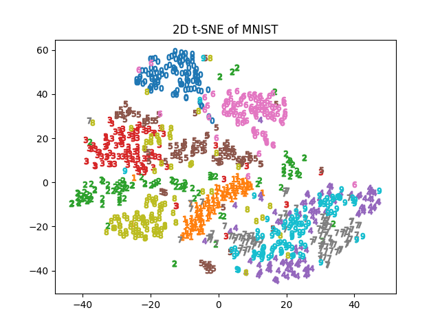

# HW1

For the following assignment I visualized the MNIST data in two dimensions using the [Scikit Learn package for the PCA and the t-SNE](https://scikit-learn.org/stable/)

I also created a violin plot of the [Boston Housing data](https://github.com/rupakc/UCI-Data-Analysis/blob/master/Boston%20Housing%20Dataset/Boston%20Housing/UCI%20Machine%20Learning%20Repository_%20Housing%20Data%20Set.pdf)

